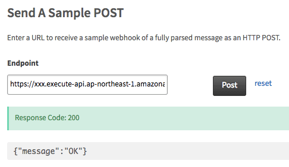
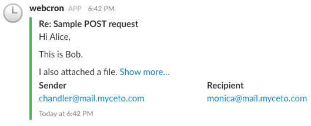

# Serverless Mailgun Slack

[](http://www.serverless.com)
[](https://circleci.com/gh/henry40408/serverless-mailgun-slack)
[](https://codecov.io/gh/henry40408/serverless-mailgun-slack)
[](https://github.com/henry40408/serverless-mailgun-slack)
[](https://github.com/henry40408/serverless-mailgun-slack)


> Redirect e-mails to Slack via Mailgun Routes

## Requirements

* Node 6.10.3, according to
  [Lambda Execution Environment and Available Libraries](http://docs.aws.amazon.com/lambda/latest/dg/current-supported-versions.html)
* AWS CLI,
  [with credentials configured](https://serverless.com/framework/docs/providers/aws/guide/credentials/)

## Installatin Dependencies

`yarn` is recommended, `npm` should work as well.

```bash
$ yarn
```

## Default Settings

* AWS region: `ap-northeast-1`

Edit `serverless.yml` to change the above settings.

```yaml
service: serverless-webcron

provider:
  # ...
  region: "ap-northeast-1" # <-- AWS region
  # ...
```

## Configure Secrets

```bash
$ cp secrets.example.yml secrets.yml
$ edit secrets.yml
```

* Replace `slack_webhook_url` with your own Slack Webhook URL.
* Replace `mailgun_api_key` with
  [Mailgun API key](https://help.mailgun.com/hc/en-us/articles/203380100-Where-can-I-find-my-API-key-and-SMTP-credentials-).

## Deploy

We need to deploy first to get callback URL of Serverless application.

```bash
$ yarn run sls deploy
```

After the deployment, use `sls info` to get the callback URL.

```bash
$ yarn run sls info
...
Service Information
...
endpoints:
  POST - https://xxxxxx.execute-api.ap-northeast-1.amazonaws.com/production/callback <-- you need this URL to configure Mailgun
```

## Configure Mailgun Routes

### Test the callback URL

1. Go to [Route: List](https://app.mailgun.com/app/routes) on Mailgun.
2. Scroll to the bottom, we should see _Send A Sample POST_ form, type the
   callback URL we got from `sls info` command above in _Endpoint_ field like
   the following screenshot:



3. Switch to Slack, we should see the notification like the following
   screenshot:



### Create new Route

1. Go to [Route: List](https://app.mailgun.com/app/routes) on Mailgun.
2. Click [Create Route](https://app.mailgun.com/app/routes/new) button on the
   top of page.
3. Then we should see the form like the following screenshot:


4. In _Expression Type_ field we select _Match Recipient_.
5. In _Recipient_ field we type e-mail address we want to intercept by Mailgun
   to redirect to Serverless application.
6. In textarea below _Store and notify_, we type the URL we got from the above
   `sls info` command.
   * _Description_ field is optional, but it's recommended to type something to
     remind us.
7. Click _Create Route_ button and everything is good to go.

For more details about Routes, please checkout
[documentation](https://documentation.mailgun.com/en/latest/user_manual.html#routes).

## License

MIT
